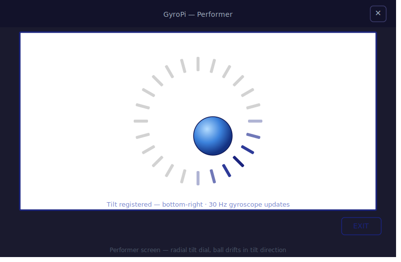
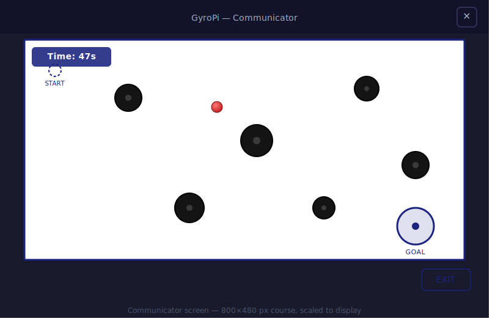
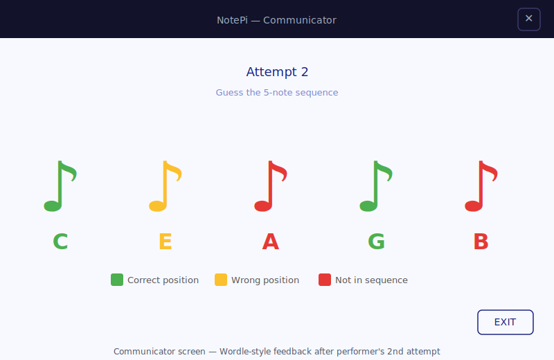
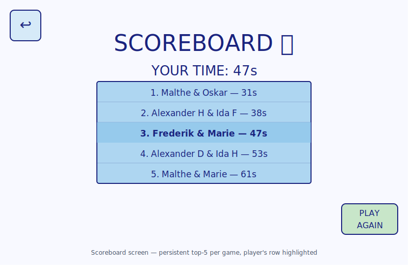
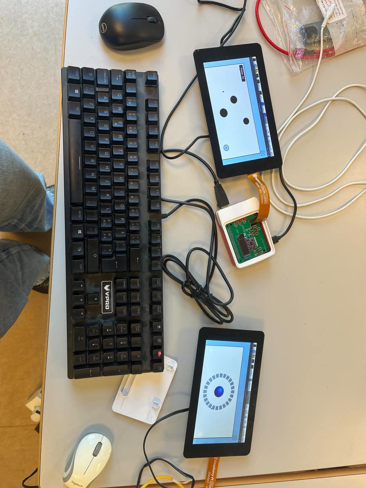

# Ready Player Pi 🎮

A distributed two-player cooperative game system built across three Raspberry Pi 5 devices, developed as a 3rd semester project at Aarhus University. Two players, physically separated — collaborate in real time through sensor-driven gameplay over a custom TCP/JSON protocol.

---

## Games

### GyroPi — tilt maze navigation

One player (the **Performer**) tilts their device to steer a ball through a maze. The other (the **Communicator**) watches the ball on their screen and guides the Performer verbally. The Performer sees only a radial tilt dial showing direction and magnitude; the Communicator sees the full course with black holes and the goal area.

| Performer | Communicator |
|---|---|
|  |  |

### NotePi — musical Wordle

The Performer plays a 5-note sequence on a physical instrument, captured by a USB microphone and classified through a DSP pipeline. The Communicator receives Wordle-style feedback: green for the correct note in the correct position, yellow for the correct note in the wrong position, red for a note not in the sequence. Players iterate until the secret sequence is found.



After each game, both players see the result and the persistent global leaderboard.



---

## System overview



The system runs across three nodes connected over Wi-Fi:

```
Performer RPi  ──TCP/JSON──▶  Server RPi  ◀──TCP/JSON──  Communicator RPi
  ClientApp                   ServerApp                     ClientApp
  Qt GUI                      ServerController              Qt GUI
  GyroscopeReader             GameRoom (forked per session)
  MicrophoneDriver            Scoreboard
  SoundAnalyzer
```

Both client nodes run the same `ClientApp` binary. The server forks a dedicated child process per active game room, isolating gameplay state from the lobby. All inter-node messages are newline-framed JSON objects over a single persistent TCP connection per client.

The software is structured using the **Entity-Control-Boundary (ECB)** pattern throughout, ensuring clean separation between domain logic, control flow, and I/O.

---

## Technology stack

| Category | Technology |
|---|---|
| Language | C++17 |
| GUI framework | Qt6 (widgets, gui, core) |
| Build system | CMake |
| Network | TCP over Wi-Fi, custom JSON protocol |
| JSON | nlohmann/json |
| Audio capture | ALSA (libasound) |
| Signal processing | kissfft (FFT-based note detection) |
| Inertial sensor | BMI160 IMU via SPI (ECE-hat) |
| Storage | JSON file (server-side top-5 scoreboard) |
| Hardware | Raspberry Pi 5, 7" touchscreen, SunFounder USB microphone |

---

## Hardware setup

Each **Game Controller** (two required):

- Raspberry Pi 5
- Official Raspberry Pi 7" touchscreen
- ECE-hat with BMI160 IMU (gyroscope + accelerometer, SPI)
- SunFounder USB microphone
- Power supply

**Server** (one required):

- Raspberry Pi 5

All three devices connect to the same Wi-Fi network.

---

## Building and running

### Client (on each Game Controller RPi)

```bash
cmake -B build && cmake --build build
./build/client-hw <server-ip>
```

### Server (on the Server RPi)

```bash
make server
./server
```

The server listens on port 9000. If no IP argument is given to the client, it defaults to `127.0.0.1`.

---

## How to play

1. Start the server on the Server RPi.
2. Launch the client on both Game Controller RPis.
3. On the first RPi, enter a username and tap **Host Room**, a room code appears.
4. On the second RPi, enter a username, tap **Join Room**, and enter the room code.
5. The host selects a game. Roles are randomly assigned at game start.
6. Play cooperatively, one player senses, one player sees.
7. After the game, both screens show the result and the global top-5 scoreboard.
8. Tap **Play Again** to start a new round with freshly randomised roles.

**Username rules:** letters and digits only, maximum 12 characters.

---

## Project structure

```
.
├── CMakeLists.txt             # Client build — produces ./build/client-hw
├── Makefile                   # Server build — produces ./server
│
├── ClientApp/
│   ├── gui/                   # Qt widgets — lobby, gameplay, scoreboard
│   ├── GyroPi/                # Tilt session logic and gyroscope reader
│   ├── NotePi/                # Audio pipeline, FFT, note detection
│   ├── ClientController.cpp   # Main client control loop (ECB: control)
│   └── ClientSocket.cpp       # TCP transport (ECB: boundary)
│
├── ServerApp/
│   ├── GyroPi/                # Server-side ball physics and course logic
│   ├── NotePi/                # Secret sequence and note validation
│   ├── ServerController.cpp   # Main server loop and connection handling
│   ├── GameRoom.cpp           # Per-session forked process
│   └── Scoreboard.h           # Persistent top-5 scoreboard
│
├── Shared/
│   ├── JSONCommunication.h    # Newline-framed JSON transport layer
│   ├── Protocol.h             # Shared JSON key constants
│   ├── NotePiProtocol.h       # NotePi-specific protocol constants
│   └── Player.h               # Player struct (username, role, partner)
│
└── docs/
    ├── system_in_action.jpg
    ├── gyropi_communicator.svg
    ├── gyropi_performer.svg
    ├── notepi_communicator.svg
    └── scoreboard.svg
```

---

## Report

The full project report is available in [`report.pdf`](report.pdf). It covers the complete development process including requirements specification, system and hardware architecture (UML/SysML), software design with class diagrams and sequence diagrams, module and integration testing, and an acceptance test against all functional and non-functional requirements.

---

## Team

3rd Semester — ECE Software Technology, Aarhus University

- Alexander Drexel Hougaard
- Alexander Kjærsgaard Drejer
- Frederik Mosekjær Staal Pedersen
- Ida Damgren Højen
- Ida Frederiksen
- Malthe Winther
- Marie Risom
- Oskar Jentzsch Seeberg
